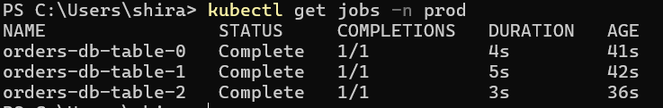
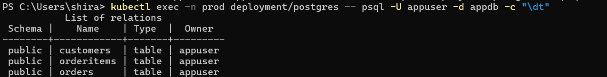
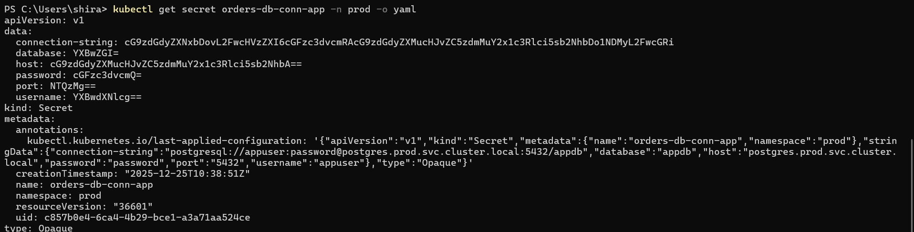

# Crossplane PostgreSQL Table Provisioning API

A Kubernetes-native API using Crossplane to declaratively provision PostgreSQL tables.

## Overview

This project implements a custom Crossplane API (`XAppDatabase`) that allows developers to declaratively define PostgreSQL schemas and tables through Kubernetes CRDs.

### Features
- Declarative table creation with column definitions
- Automatic credential management via Secrets
- Support for multiple tables with relationships
- Foreign key constraints support
- Pipeline-based Composition using function-go-templating

## Prerequisites

- Kubernetes cluster (v1.28+)
- kubectl configured
- Helm 3.x
- Basic understanding of Crossplane concepts

## Architecture
```
User applies XAppDatabase CR
         ↓
Crossplane reconciles via Composition
         ↓
function-go-templating generates Kubernetes Jobs
         ↓
Jobs execute psql CREATE TABLE commands
         ↓
Tables created in PostgreSQL
         ↓
Connection Secret created
```

## Installation

### 1. Deploy PostgreSQL (Prerequisite)
```bash
kubectl apply -f postgresql/
```

Wait for PostgreSQL to be ready:
```bash
kubectl wait --for=condition=ready pod -l app=postgres -n prod --timeout=300s
```

### 2. Install Crossplane Providers and Functions with the bash script
```bash
cd crossplane/
chmod +x install.sh
./install.sh
```

### 5. Deploy CRD and Composition
```bash
kubectl apply -f xappdatabase/xrd.yaml
kubectl apply -f xappdatabase/composition.yaml
```

Verify:
```bash
kubectl get xrd
kubectl get composition
```

## Usage

### Create a Database with Tables

Apply an example:
```bash
kubectl apply -f xappdatabase/examples/orders-db.yaml
```

Example CR:
```yaml
apiVersion: database.platform.example.com/v1alpha1
kind: XAppDatabase
metadata:
  name: orders-db
spec:
  parameters:
    database: appdb
    schema: public
    tables:
      - name: users
        columns:
          - name: id
            type: serial primary key
          - name: email
            type: varchar(255)
          - name: created_at
            type: timestamp
      - name: orders
        columns:
          - name: id
            type: serial primary key
          - name: user_id
            type: int references users(id)
          - name: total
            type: numeric(10,2)
```

### Verify Tables in PostgreSQL
```bash
kubectl exec -it -n prod $(kubectl get pod -n prod -l app=postgres -o name) -- \
  psql -U appuser -d appdb -c "\dt"

```


## Cleanup
```bash
# Delete XAppDatabase resources
kubectl delete xappdatabase --all

# Uninstall Crossplane
helm uninstall crossplane -n crossplane-system

# Delete PostgreSQL
kubectl delete -f prerequisites/
```

## Results

### Screenshots

#### 1. Crossplane and Providers Installed


#### 2. XAppDatabase Created


#### 3. Jobs Completed Successfully


#### 4. Tables in PostgreSQL


#### 5. Connection Secret Generated


## Optional Enhancements

- [ ] OpenAPI schema validation for column types
- [ ] Composite Resource Claims (namespace-scoped)
- [ ] Cleanup logic (drop tables on deletion)
- [ ] Index creation support
- [ ] Data migration jobs

## License

MIT

## Author

[Your Name]